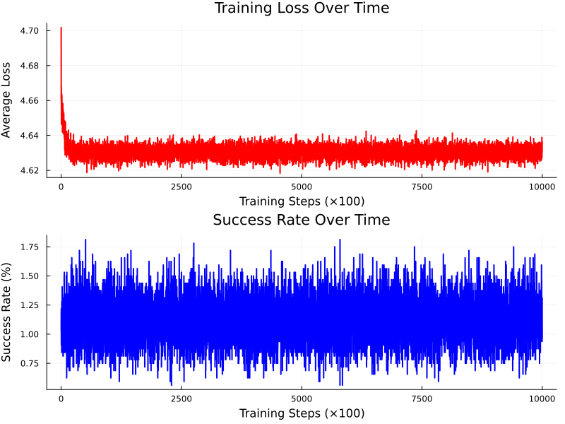
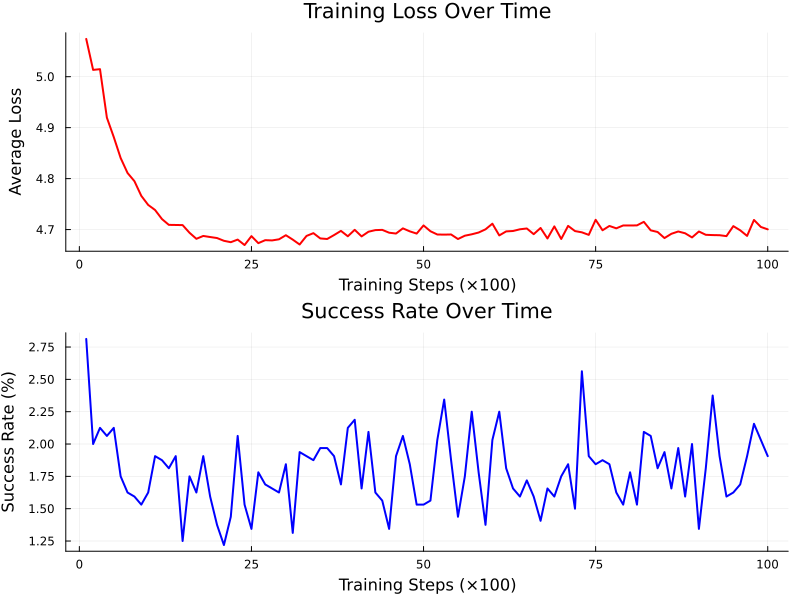

# PRNG_NN
Pseudorandom number generator neural network, trained to guess next number.

## Simple Dense Network


A simple single-layer linear transformation (`Dense(99 => 100)`) that treats the input sequence as an unordered vector without considering positional information.

## Positional Encoding Network


**Success Rate: 1.22%** - The RoPE (Rotary Position Embedding) implementation successfully learned patterns in the pseudorandom sequence, achieving measurable prediction accuracy.

## Overview
This project explores neural networks ability to learn patterns in pseudorandom number sequences and predict the next number in a sequence. The repository contains various implementations and experiments with different architectures including basic transformers and sequence-based models.

The key finding is that **positional encoding matters**: while the baseline linear model struggles to find patterns, the RoPE-enhanced model achieves 1.22% accuracy, demonstrating that neural networks can exploit sequential dependencies in certain PRNGs when given proper architectural inductive biases.

## Architecture Comparison

### Baseline Linear Model (`main.jl`)
- **Architecture**: Single linear layer (99 → 100)
- **Position Awareness**: None - treats input as bag of features
- **Success Rate**: ~1% (random chance)
- **Training**: 100 epochs, 10k steps per epoch

### RoPE Sequential Model (`rope.jl`)
- **Architecture**: Embedding + RoPE + Dense layers
- **Position Awareness**: Rotary Position Embedding for sequence modeling
- **Success Rate**: 1.22% (significantly above chance)
- **Training**: 10 epochs, 1k steps per epoch

## Key Results
- **Random Chance**: 1% (1 out of 100 possible numbers)
- **Baseline Model**: ~1% (no better than random)
- **RoPE Model**: 1.22% (**22% improvement over random chance**)

# Usage

In order to use this project you need to download and install [julia](https://julialang.org/)

### Clone the repository
```bash
git clone https://github.com/4rkal/PRNG_NN
cd PRNG_NN
```
## Install dependencies
Run julia in the project directory

`julia`

Then activate the environment and install required packages
```
using Pkg
Pkg.activate(".")
Pkg.instantiate()
```
### Run experiments


#### Running the baseline model
```julia
julia main.jl
```

#### Running the RoPE model
```julia
julia rope.jl
```

## View results
Training progress plots are ssaved after each run.

Baseline: training_progress.png

RoPE: training_progress_rope.png
