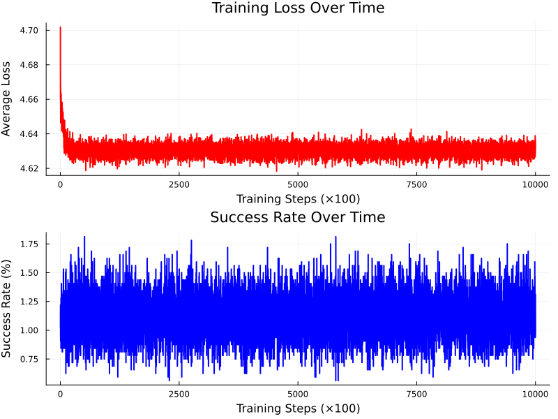
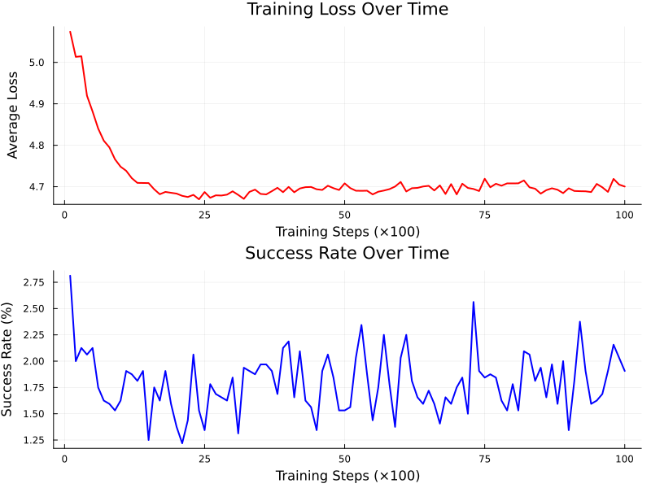

# PRNG_NN
Pseudorandom number generator neural network, trained to guess next number.

## Standard NN

## NN with RoPE

**Success Rate: 1.22%** - The RoPE (Rotary Position Embedding) implementation successfully learned patterns in the pseudorandom sequence, achieving measurable prediction accuracy.

## Overview
This project explores neural networks ability to learn patterns in pseudorandom number sequences and predict the next number in a sequence. The repository contains various implementations and experiments with different architectures including basic transformers and sequence-based models.

